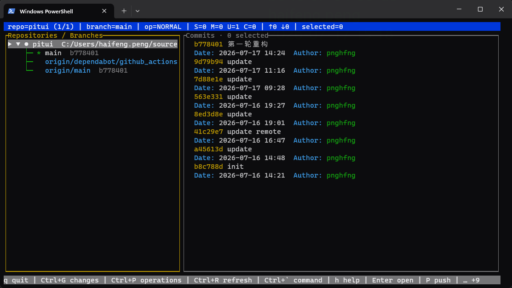
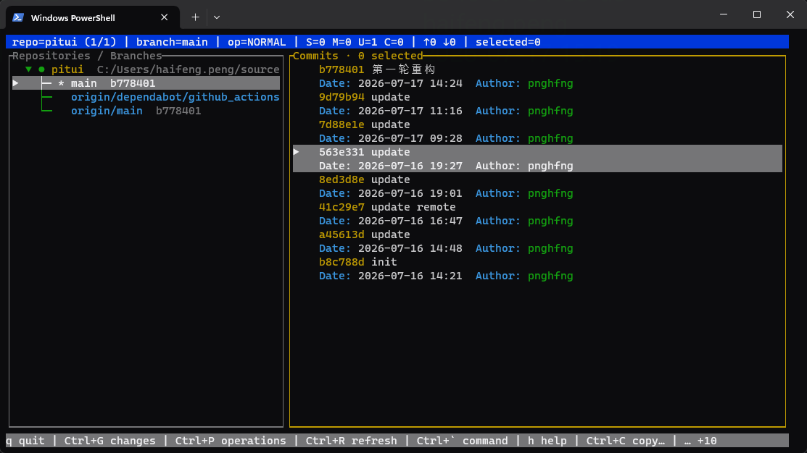
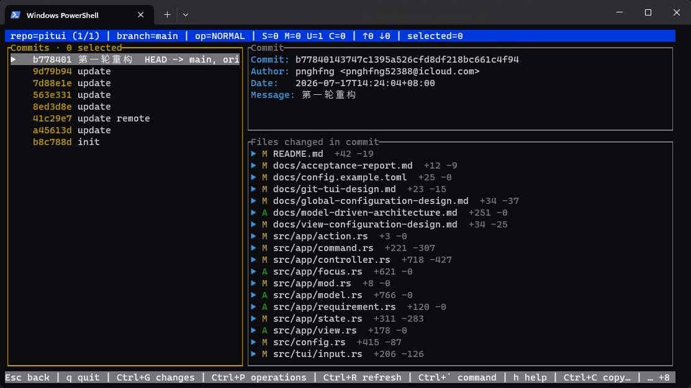
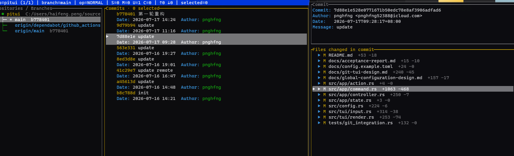
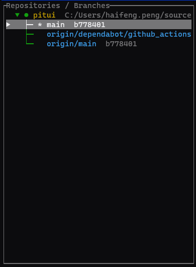
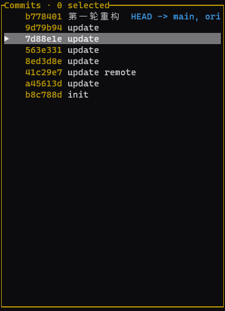
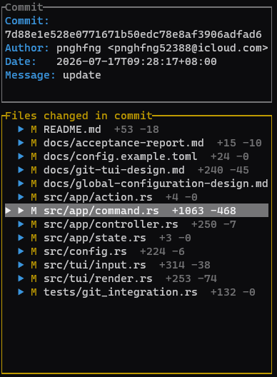

# Pitui Next 最终设计方案

> **目标架构：Data Driven Development + `bevy_ecs`**
> 本文是下一代 Pitui 重新开发的权威设计、资产复用清单和实施计划。这里的 DDD
> 只表示 **Data Driven Development（数据驱动开发）**，不表示领域驱动设计。
> 当前 `src/app` 中的 Model/View/Controller 实现只作为行为基线和测试资产，不在其核心上
> 继续重构，也不是下一代运行时的一部分。

---

## 1. 最终目标

整个项目以数据驱动为唯一核心：

1. 操作只修改数据或产生待执行的数据，不直接调用 Renderer。
2. Renderer 只解析当前数据，不处理输入、不响应操作、不执行 Git。
3. Dataset 是 ECS World 中的核心 Entity，也是 Git 事实数据的唯一载体；不存在平行的
   `GitModel` 或 Git Data Entity。
4. Command、Operation、快捷键、Render Proxy、Render Mode、Git 请求/结果、确认状态和日志
   都以数据表示。
5. 全局同一时刻只有一个 Active Dataset、一个 Active Render Mode 和一套已经合并解析的
   Operation Set；快捷键索引属于该 Operation Set。
6. 全局操作和当前 Dataset 操作合并后一次性生效，Input 不再依次查询多套快捷键表。
7. Git 第一阶段同步执行；成功后原子替换 Dataset，失败时保留最后一次成功缓存。
8. 不在 TUI 中处理冲突。由 Pitui 发起并产生冲突的 cherry-pick/rebase/pull-rebase 必须自动
   abort，然后显示提示并记录日志。

目标数据流：

```text
Terminal Event
    -> InputIntent data
    -> active ResolvedOperationSet
    -> CommandInvocation data
    -> ECS Systems mutate Dataset / Context data
    -> optional GitCommand data
    -> synchronous GitExecutor
    -> parsed temporary snapshot
    -> atomic Dataset replacement
    -> Projection Systems
    -> UiFrame data
    -> Renderer
```

任何 System 都不得在数据修改完成后直接调用 `render()`。

---

## 2. 已确定的产品和架构决策

| 决策 | 第一阶段结论 |
|---|---|
| ECS 实现 | 仅依赖独立的 `bevy_ecs` crate，不引入完整 Bevy 引擎 |
| Git 数据所有权 | Git 输出解析后直接更新关联 Dataset；没有单独 Git Data Entity |
| Dataset 实例 | 可以有任意多个，并可以通过有序引用包含其他 Dataset |
| Active 与渲染 | Active Dataset 只决定当前操作和高亮；Render Mode 是独立全局数据 |
| Render Mode 切换 | 某些操作同时修改 Active Dataset 和 Render Mode，另一些只修改 Active Dataset |
| Render 数量 | 不设置固定 slot 上限；Render Mode 使用可递归布局树绑定任意数量 Render Proxy |
| Render Proxy | 每个 Dataset 可提供多个可配置 Proxy；Proxy 解释同一 Dataset 的不同字段/密度 |
| Operation/快捷键 | 快捷键是 Operation 属性，一个 Operation 可绑定任意数量快捷键 |
| 快捷键冲突 | 全局与局部合并后的有效 Operation Set 中不允许重复 KeySequence |
| Command 优先级 | 同名 Command 由全局定义优先；快捷键冲突仍视为配置错误，不做静默覆盖 |
| Command 参数 | v1 命令输入只接受命令名；文本参数、引号、补全列入 TODO |
| 隐式目标 | Operation 可从 Active Dataset、Cursor、Selection 生成目标数据，不属于文本参数 |
| Git 执行 | v1 同步执行，不建立异步请求/响应状态机 |
| 加载展示 | 不显示 loading/empty/error 文案；刷新失败保留缓存并通过全局 Context 提示 |
| Confirmation | 全局唯一 Context Dataset，同一时间只显示一个弹窗 |
| Changes | 全局唯一 Changes Dataset，根据当前 Repository 同步刷新；v1 不支持 stash |
| 创建提交 | `CommitCreationDataset` 按 Repository 建模，拥有独立 metadata、Render Proxy 与 Operation Set，不复用通用 TextInput |
| Reflog | 普通 Dataset，但只通过 Command 进入，不提供默认进入快捷键 |
| 日志 | 全局 GitOperationLog Dataset；InternalOperationLog Dataset 列为 TODO |
| 冲突 | 不提供解决器；只对本次 Pitui 发起的操作执行自动 abort |

---

## 3. 核心术语

### 3.1 Dataset

Dataset 是一个带 `Dataset` marker 的 ECS Entity。它可以是集合，也可以是具体条目：

```text
RepositoriesBranchesDataset
├─ RepositoryDataset
│  ├─ BranchDataset
│  │  └─ CommitsDataset
│  │     ├─ CommitDataset
│  │     │  └─ FilesDataset
│  │     │     ├─ FileDataset
│  │     │     │  └─ FileChangesDataset
│  │     │     └─ FileDataset
│  │     └─ CommitDataset
│  └─ BranchDataset
└─ RepositoryDataset
```

严格使用单复数区分：

- `CommitsDataset`、`FilesDataset` 是集合 Dataset。
- `CommitDataset`、`FileDataset` 是条目 Dataset。
- 集合只保存有序子 Dataset Entity 引用；条目 metadata 只保存在条目 Dataset 上。

列表/树形 Render Proxy 的 **focus owner 是集合 Dataset**，当前行由该集合的
`DatasetCursor` 表示。例如在 Commits 列中按上下键只修改 `CommitsDataset` 的 Cursor，
不会把 Active Dataset 改成某个 `CommitDataset`，也不会把焦点自动跳到右侧。只有显式的
open/left/right 等层级操作才改变 Active Dataset；它可以同时决定是否切换 Render Mode。

条目 Dataset 仍然是完整的数据实体，可以被 detail Proxy 绑定，也可以在某个 Render Mode
中声明为 focus owner。是否可聚焦属于 Proxy/Mode 数据，不由 Renderer 临时判断。

### 3.2 Meta Data

Meta Data 使用 typed Component 表示，不使用动态 `HashMap<String, Value>`：

```rust
#[derive(Component)]
struct BranchMetadata {
    name: BranchName,
    is_current: bool,
    head: CommitHash,
}

#[derive(Component)]
struct CommitMetadata {
    hash: CommitHash,
    author: String,
    authored_at: String,
    subject: String,
    message: String,
    tags: Vec<String>,
}
```

Data Driven 表示状态组合和行为选择由数据决定，不表示放弃 Rust 类型系统。

### 3.3 Operation 与 Command

- **Command**：稳定、可通过 `Ctrl+P` 输入的语义动作，如 `reflog`、`pull`、`sync`。
- **Operation**：某个 Dataset 当前提供的 Command 入口，包含快捷键、可用条件和隐式目标来源。
- 每个 Operation 必须引用一个 Command；Command 可以没有快捷键。
- 快捷键和命令输入最终都生成同一种 `CommandInvocation` 数据。

### 3.4 Render Proxy

Render Proxy 是“如何解释一个 Dataset”的数据描述，不拥有事实数据。一个 Dataset 可以提供
多个 Proxy，例如 `FileChangesDataset` 可以提供 unified 和 side-by-side 两种 Proxy。

### 3.5 Render Mode

Render Mode 是全局唯一、当前生效的一棵布局树。它绑定多个 Dataset 与 Render Proxy，
但不决定哪个 Dataset 接收操作。

### 3.6 Context Dataset

Context Dataset 是全局唯一的临时交互数据，如 Confirmation/Notice。它通过 Overlay Render
Mode 显示，并通过 Context Stack 恢复进入前的 Active Dataset 与 Render Mode。

---

## 4. 当前代码资产盘点

盘点日期：2026-07-17。当前仓库约有 **20,564 行 Rust**：

| 区域 | 行数 | 当前职责 | 下一代处理 |
|---|---:|---|---|
| `src/app` | 7,844 | AppState、Model、Focus、Controller、Operation、View | 核心重写，仅参考行为 |
| `src/git` | 3,058 | Git protocol、runner、parser、worker、JSONL logging | runner/parser/logging 高复用 |
| `src/domain` | 542 | Git 值类型与 Diff 数据/算法 | 高复用，转为 Component payload |
| `src/tui` | 4,112 | terminal、input、renderer | terminal 高复用，input/render 编排重写 |
| `src/config.rs` | 2,404 | 配置发现、解析、keymap、View/Operation 配置 | 基础解析复用，AppState 相关 resolver 重写 |
| `tests` | 2,454 | 配置 CLI 与真实 Git 集成测试 | 作为行为验收资产迁移 |
| 入口代码 | 150 | CLI、路径解析、程序启动 | 大部分可复用 |

当前测试资产：

```text
src 内 #[test]：             89
配置 CLI 集成测试：           3
真实 Git 集成测试源码：       37
  - macOS 当前启用：          36
  - 非 macOS Unix 专用：       1
源码声明合计：               129
macOS 当前执行合计：          128
```

本次资产盘点已在 macOS 执行 `cargo test --all-targets`，89 个单元测试、3 个配置 CLI 测试和
36 个当前平台 Git 集成测试全部通过；剩余 1 个测试只在支持创建非 UTF-8 文件名的非 macOS
Unix 文件系统启用。

### 4.1 可直接或高比例复用

| 资产 | 复用判断 | 说明 |
|---|---|---|
| `src/git/parser.rs` | 85%～95% | 输入/输出解析与 App 架构基本无关 |
| `src/git/runner.rs` | 75%～90% | argv、安全策略、remote policy 和 auto-abort 可保留；入口改为同步 Executor |
| `src/git/logging.rs` | 80%～90% | JSONL、脱敏、轮转和持久化策略可保留 |
| `src/domain/diff.rs` | 80%～90% | unified 数据和 side-by-side 对齐算法可直接复用 |
| `src/domain/model.rs` | 50%～70% | `CommitHash`、`BranchName`、`GitPath` 等值类型可成为 Components 字段 |
| `src/tui/mod.rs` | 75%～90% | terminal raw mode、alternate screen、OSC 52 等边界能力可复用 |
| `.github`、License、安全文档 | 接近 100% | CI、Issue、PR、安全和发布资产继续使用 |

### 4.2 需要适配后复用

| 资产 | 处理 |
|---|---|
| `src/git/protocol.rs` | 保留 Git payload 语义，去除面向旧 Controller 的 envelope/job 上下文 |
| `src/git/worker.rs` | v1 同步执行，不进入新运行时；日志打开和 channel 测试可作为参考 |
| `src/config.rs` | 保留路径发现、TOML、KeyStroke、日志配置；Operation/View resolver 对接新 Registry |
| Diff Renderer | 保留绘制算法，输入改为 `RenderProxyProjection`，不再读取 AppState |
| TUI 样式与 sanitization | 保留颜色、控制字符清理、宽度降级等纯函数 |
| 集成测试 | 保留 Git 语义断言，替换 Controller/Focus 细节断言 |

### 4.3 只作为参考、需要重新设计

- `AppState`、`GitModel`、`NavigationState` 和 `Controller`。
- 当前 `Screen/ViewProjection` 风格的 Renderer 编排。
- 当前按 AppState/GlobalMode 分派的 Input Mapper。
- `OperationSpec::fn(&AppState) -> Option<Action>`。
- 异步 pending/latest job、stale response 和 loading resource 逻辑。

现有代码的主要价值是已经验证的 Git 语义、安全策略和交互验收，不是旧应用层抽象。

---

## 5. 新项目模块边界

建议在同一仓库建立 workspace；Legacy 代码在新运行时完成验收前只作为对照，不参与新 World：

```text
crates/
├─ pitui-core/       # 纯 Git value types、Diff、parsed payload；不依赖 bevy_ecs/TUI
├─ pitui-data/       # Dataset Components/Resources/Messages、IDs、Command/Proxy specs
├─ pitui-ecs/        # World、Resources、Messages、Systems、Schedules
├─ pitui-git/        # parser、runner、sync executor、Git operation logging
├─ pitui-config/     # strict TOML、key/proxy/command config resolver
├─ pitui-tui/        # terminal adapter、input events、UiFrame renderer
└─ pitui/            # composition root / binary
```

依赖方向：

```text
pitui-core <- pitui-data <- pitui-ecs
pitui-core <- pitui-git  <- pitui-ecs
pitui-data <- pitui-config
pitui-data <- pitui-tui

pitui binary 依赖并组装上述各 crate；其他 crate 不反向依赖 binary。
```

`pitui-git` 只能依赖 `pitui-core` 的纯 payload，不能依赖 `bevy_ecs` 或 TUI；ECS System 在
边界处把 `ParsedGitPayload` 写成 Dataset Components。不得让 `pitui-data` 依赖 ratatui、
crossterm 或 Git CLI，也不得把 ECS `World` 暴露给 `pitui-tui`。

---

## 6. ECS World 设计

### 6.1 Dataset 基础 Components

```rust
#[derive(Component)]
struct Dataset;

#[derive(Component, Clone, Eq, Hash, PartialEq)]
struct DatasetKey(DatasetIdentity);

#[derive(Component)]
struct DatasetType(DatasetKind);

#[derive(Component)]
struct DatasetRevision(u64);

#[derive(Component)]
struct DatasetChildren(Vec<Entity>); // 顺序即显示/业务顺序

#[derive(Component)]
struct DatasetCursor(Option<Entity>);

#[derive(Component)]
struct DatasetSelection(Vec<Entity>);

#[derive(Component)]
struct DatasetTemplateRef(DatasetTemplateId);
```

`DatasetTemplateRef` 指向共享定义，其中包含默认 Operation Set 与 Render Proxy Set。不能在
每一个 CommitDataset 上复制相同的静态操作和渲染描述。

### 6.2 Dataset 稳定身份与共享

ECS `Entity` 只是进程内句柄，必须通过稳定 Key 去重：

```rust
#[derive(Resource)]
struct DatasetIndex {
    by_key: HashMap<DatasetIdentity, Entity>,
}

enum DatasetIdentity {
    GlobalRepositoriesBranches,
    Repository(RepositoryKey),
    Branch { repository: RepositoryKey, name: BranchName },
    Commits { repository: RepositoryKey, branch: BranchName },
    Commit { repository: RepositoryKey, hash: CommitHash },
    Files { repository: RepositoryKey, commit: CommitHash },
    File { repository: RepositoryKey, commit: CommitHash, path: GitPath },
    FileChanges { repository: RepositoryKey, commit: CommitHash, path: GitPath },
    Reflog(RepositoryKey),
    ReflogEntry { repository: RepositoryKey, selector: String },
    Remotes(RepositoryKey),
    Remote { repository: RepositoryKey, name: String },
    GlobalChanges,
    WorkingTreeFiles {
        repository: RepositoryKey,
        boundary: ChangeBoundary, // Staged | Unstaged
    },
    WorkingTreeFile {
        repository: RepositoryKey,
        boundary: ChangeBoundary, // Staged | Unstaged
        path: GitPath,
    },
    WorkingTreeFileChanges {
        repository: RepositoryKey,
        boundary: ChangeBoundary,
        path: GitPath,
    },
    CommitCreation(RepositoryKey),
    GlobalInteractionContext,
    GlobalGitOperationLog,
    GitOperationLogEntry(u64),
}
```

同一仓库中被多个 Branch 引用的 Commit 必须共享一个 canonical `CommitDataset`。不同
`CommitsDataset` 的 `DatasetChildren` 可以引用同一个 Entity，避免 metadata 副本漂移。
因此 Dataset 关系是有序 DAG，不是要求独占所有权的树；配置或解析生成环必须失败。

刷新时不能因为一个父集合移除子引用就立即 despawn。原子提交后由 GC System 从全局
singleton roots、Repository roots、ActiveUiContext、Render bindings 和 ContextStack 做
mark-and-sweep；只有不可达 Entity 才从 World 与 `DatasetIndex` 同时移除。这样共享 Commit
不会因某个 Branch 刷新而失效，返回栈也不会保存悬空 Entity。

### 6.3 Dataset 刷新

刷新必须是事务式的：

```text
execute Git
  -> parse into TemporaryDatasetSnapshot
  -> validate all references and ordering
  -> update/create child Dataset entities
  -> atomically replace parent DatasetChildren/metadata
  -> increment DatasetRevision
```

执行或解析失败时：

- 不清空旧 Dataset。
- 不增加成功 revision。
- 向全局 Notice/Confirmation Context 写入提示。
- 向 GitOperationLog Dataset 和持久化日志写入失败记录。

为了区分“合法空集合”和“从未成功加载”，内部保留 `HasSnapshot`/revision 数据，但 Render
Proxy 不显示 loading/empty/error 文案。初次没有缓存时可以渲染空白区域。

---

## 7. 全局 Resources 与状态不变量

```rust
#[derive(Resource)]
struct ActiveUiContext {
    active_dataset: Entity,
    render_mode: RenderModeId,
    render_bindings: RenderContextBindings,
    resolved_operations: ResolvedOperationSetId,
    generation: u64,
}

#[derive(Resource)]
struct ContextStack(Vec<UiContextSnapshot>);

struct UiContextSnapshot {
    active_dataset: Entity,
    render_mode: RenderModeId,
    render_bindings: RenderContextBindings,
}
```

`RenderContextBindings` 是当前界面语义槽位到具体 Dataset Entity 的映射，例如
`CurrentCommits -> Entity`、`CurrentCommit -> Entity`、`CurrentFiles -> Entity`、
`Changes -> Entity`。它本身也是数据。Branch/Commit/File 的 Cursor 改变时，Reconcile System
可以更新依赖槽位和右侧详情，但不得顺带改变 Active Dataset。Context Stack 必须连同
bindings 一起保存，否则返回上一层时无法完整恢复原来的界面。

Operation 可以声明 Context Transition：

```rust
enum ContextTransition {
    KeepRenderMode {
        active_dataset: Entity,
        binding_patch: RenderBindingPatch,
    },
    Replace {
        active_dataset: Entity,
        render_mode: RenderModeId,
        render_bindings: RenderContextBindings,
    },
    Push {
        active_dataset: Entity,
        render_mode: RenderModeId,
        render_bindings: RenderContextBindings,
    },
    Pop,
}
```

切换 Active Dataset 后必须在同一个 Reconcile 阶段重新生成唯一的
`ResolvedOperationSet`。Input、footer、help 和命令面板只读取这一个结果。

核心不变量：

1. World 中每个稳定 DatasetIdentity 最多对应一个活跃 Entity。
2. 全局同时只有一个 `ActiveUiContext`。
3. 全局同时只有一个生效的 `ResolvedOperationSet`。
4. Active Dataset 必须是当前 Render Mode 中某个 focusable Proxy 的 focus owner，或是正在
   显示的 Overlay Context。
5. Cursor/Selection 变化不得隐式转移 Active Dataset。
6. Context Pop 后必须成对恢复 Active Dataset、Render Mode 与全部 Render Bindings。

---

## 8. Operation、Command 与快捷键

### 8.1 数据结构

```rust
struct CommandSpec {
    id: CommandId,
    name: String,
    scope: CommandScope,      // Global | Dataset
    system: CommandSystemId,  // 注册好的 ECS System
}

struct OperationSpec {
    id: OperationId,
    command: CommandId,
    bindings: Vec<KeySequence>,
    target_source: TargetSource,
    availability: AvailabilityRuleId,
}

enum TargetSource {
    None,
    ActiveDataset,
    Cursor,
    Selection,
    SelectionOrCursor,
    ContextSelectionOrCursor(RenderBindingId),
}

struct CommandInvocation {
    command: CommandId,
    source_dataset: Entity,
    targets: Vec<Entity>,
    source: InvocationSource, // KeyBinding | CommandPalette
}
```

Command/Invocation 是数据；真正算法由 `CommandSystemId` 指向的已注册 System 实现。v1 不
允许通过 TOML 注入代码、Shell 或 Git argv 模板。

### 8.2 唯一有效 Operation Set

```text
GlobalOperationSet
    + ActiveDatasetTemplate.operation_set
    + per-dataset/config overrides
    -> validate command-name priority
    -> validate every KeySequence is unique
    -> ResolvedOperationSet
```

- 同名 Command：Global 优先。
- 重复快捷键：配置/解析失败，不允许不可达的局部 Operation 静默存在。
- 一个 Operation 可绑定零个、一个或多个 KeySequence。
- `Ctrl+P` 输入 Command 名称；v1 输入中包含额外 token 时提示“参数功能尚未支持”。

`Global` 表示普通 Dataset 都能参与合并，不表示忽略交互上下文无条件执行。Confirmation、
文本输入和 chord 等 Context 通过数据化的 Availability/whitelist 生成独占的有效集合，危险
弹窗后面不能继续响应 push/reset 等命令；全局仍只有这一个解析后的 Operation Set。

默认交互配置也是数据，必须满足以下产品基线；用户可以改绑，但不能产生冲突：

- `W/A/S/D` 分别提供 Up/Left/Down/Right，方向键提供同义绑定。
- `h` 打开帮助，内容只来自当前 `ResolvedOperationSet`，不展示其他 Dataset 的 Operation。
- `Ctrl+G` 绑定全局 `changes`，从任意非 modal Context 进入并通过 ContextStack 返回。
- `Ctrl+R` 绑定全局手动 `refresh`；不存在定时刷新 Operation 或后台轮询。
- `Ctrl+Space` 保持未绑定并通过配置校验测试锁定。
- footer 只显示当前状态下 `AvailabilityRule` 为真的 Operation。二级快捷键只先显示第一级；
  第一级按下后，footer/help 才切换为该 chord 的第二级 Operation Set。
- Commits 默认可用 `Ctrl+C -> h/i/m` 复制所选 commit hashes、当前 commit info、message；
  Files/File detail 上同一前缀只挂载 `Ctrl+C -> n/a/r`，分别复制文件名、绝对路径、仓库
  相对路径，不能泄漏 commit copy。
- 状态栏不显示 `view`、`viewing`、`focus` 等内部实现名。

一级 chord 命中后只写入 `PendingChordState` 数据；Reconcile 随即把全局唯一的
`ResolvedOperationSet` 替换为该 chord 的第二级集合。完成、取消或超时后再恢复基础集合，
Input 任何时刻都不能并行查询“基础表 + chord 表”。

多选直接保存在 `CommitsDataset.Selection`，Space 负责选择/反选。cherry-pick 只消费该有序
Selection；没有选择时不执行，也不再引入 queue mode 或独立队列数据。执行前按当前
`CommitsDataset.Children` 的历史顺序规范化：hash copy 保持列表顺序，cherry-pick 对依赖序列
使用 oldest-to-newest replay 顺序，不能使用用户按 Space 的先后顺序决定 Git argv。

### 8.3 无文本参数下的目标

需要对象的操作从 Dataset Context 读取目标：

```text
cherry-pick -> Active CommitsDataset.Selection
reset       -> Active CommitDataset，或 CommitsDataset.Cursor
              或 ReflogDataset.Cursor
stage       -> Changes binding 的 SelectionOrCursor（仅 Unstaged 目标）
unstage     -> Changes binding 的 SelectionOrCursor（仅 Staged 目标）
file-diff   -> Active FilesDataset.Cursor
```

若上下文不能提供目标，Command 不执行并生成 Notice。未来的
`cherry-pick <hash>...`、`reset <hash>` 属于 Command Arguments TODO，不影响当前 Operation
通过 Selection/Cursor 工作。

第一阶段全局 Command 至少包括：

```text
quit help refresh changes reflog remotes logs
fetch pull push sync back
```

`pull` 固定使用 `pull --rebase`，不读取 Git 配置改为 merge；`sync` 定义为该 pull 成功后再
`push`。pull 失败或冲突自动 abort 后不得继续 push；pull 成功但 push 失败属于部分成功，
不能回滚 pull。

---

## 9. Render Proxy 与 Render Mode

### 9.1 Render Proxy

```rust
struct RenderProxySpec {
    id: RenderProxyId,
    dataset_kind: DatasetKind,
    renderer: RendererKind,
    fields: Vec<FieldSpec>,
    style: StyleSpec,
}

enum RendererKind {
    Tree,
    List,
    CommitDetail,
    UnifiedDiff,
    SideBySideDiff,
    Confirmation,
    CommitCreation,
    LogList,
}
```

Config 可以控制已注册字段、顺序、密度、日期/hash 格式和样式，但不能注册任意 Rust 函数。
默认 Commit 列的时间精确到分钟，tag 只在非空时渲染；窄列使用 compact Proxy，宽列使用
detailed Proxy。所有 File/Commit detail/Diff 文本 Proxy 统一挂载 Home、End、PageUp、PageDown
滚动 Operation，不能由单个 Renderer 私自处理。

### 9.2 无 slot 上限的布局树

```rust
enum RenderLayout {
    Row(Vec<RenderLayout>),
    Column(Vec<RenderLayout>),
    Overlay(Vec<RenderLayout>),
    Dataset {
        dataset: DatasetBinding,
        proxy: RenderProxyId,
        constraint: LayoutConstraint,
        focusable: bool,
    },
}

enum DatasetBinding {
    Stable(DatasetIdentity),       // 全局 singleton 等稳定对象
    Context(RenderBindingId),      // CurrentCommits/CurrentCommit/... 语义槽位
}

#[derive(Resource)]
struct ActiveRenderMode {
    id: RenderModeId,
    layout: ResolvedRenderLayout,  // 每个叶节点已经解析为具体 Entity
}
```

配置保存 `RenderLayout` 模板，Reconcile System 使用当前 `RenderContextBindings` 解析出全局
唯一的 `ActiveRenderMode`。Renderer 不解析字符串、不追踪 Cursor，也不自行猜测“当前 commit”
是谁。某个 Cursor 改变后只更新受影响的 Context binding 和 Projection，因此可以在右侧内容
自动更新的同时保持左侧 focus 不变。

Render Mode 不限制 Dataset 叶节点数量。空间不足时仍必须按照配置渲染全部绑定项，通过
minimum/percentage/fill 约束压缩或裁剪；v1 不自动隐藏 Dataset。无论绑定多少项，只有
Active Dataset 对应的可聚焦 Proxy 显示 active border。

### 9.3 参考 Render Modes

History Mode：



同一个 History Mode 中只切换 Active Dataset：



Commit Mode：



三栏模式说明 Render Mode 可以组合任意数量 Dataset：



上述模式的绑定语义至少包含：

```text
HistoryMode
  Row[
    RepositoriesBranches(compact, focusable),
    CurrentCommits(detailed, focusable),
  ]

CommitMode
  Row[
    CurrentCommits(compact, focusable),
    Column[
      CurrentCommit(detail, non-focusable),
      CurrentFiles(list, focusable),
    ],
  ]

FileDiffMode
  Row[
    Column[
      CurrentCommit(detail, non-focusable),
      CurrentFiles(list, focusable),
    ],
    CurrentFileChanges(unified-or-side-by-side, focusable),
  ]
```

这三棵树是可配置参考值，不是硬编码页面枚举。尤其在 Commits/Files 中上下移动时，只更新
`CurrentCommit`/`CurrentFiles`/`CurrentFileChanges` bindings；左右/open/back 才执行逻辑层级
切换。这样右侧详情可以随选择更新，焦点不会被详情刷新抢走。

左右键表示数据层级而不是循环切栏：Right 在当前 Mode 的最右可聚焦叶节点继续深入时 Push
下一 Render Context，Left 在最左可聚焦叶节点时 Pop；两端都不得回绕。深入后原右侧的语义
上下文成为下一 Mode 的左侧，因此 FileDiffMode 左侧继续保留 Commit detail + Files，而不是
退化成孤立 Files 列。

Dataset 自己提供的 Proxy 参考：

| Dataset | Proxy 示例 |
|---|---|
| Repositories/Branches |  |
| Commits |  |
| Commit |  |
| FileChanges | unified 与 side-by-side；原始参考图未纳入仓库，正式开发前补充 |

### 9.4 Projection 与 Renderer

```text
ActiveRenderMode + Dataset Components + RenderProxySpecs
    -> Projection Systems
    -> immutable UiFrame
    -> ratatui Renderer
```

Renderer 不得查询 Active Dataset 来决定 Mode，也不得修改 Dataset。Dataset revision 或
ActiveUiContext generation 变化后，由 Projection 阶段生成新 UiFrame；这不是 Operation
直接触发渲染。

### 9.5 配置边界

下一代保留一份版本化、严格校验的全局配置，并按数据职责拆分：

| 配置域 | 可配置内容 |
|---|---|
| Global interaction | 全局 Operation bindings、help/command 入口、footer 是否展示及展示哪些 Operation |
| Dataset Template | 当前 Dataset 可用 Operations、bindings、availability 和默认 Proxy 集合 |
| Render Proxy | 字段、顺序、compact/detailed density、日期/hash 格式、颜色与 Diff 呈现 |
| Render Mode | 递归布局树、Dataset bindings、Proxy、尺寸约束、focusable 属性 |
| Diff | 默认 unified/side-by-side 模式及共享滚动表现 |
| Logging | 持久化路径、level、JSONL、单文件大小、轮转数量、buffer/flush 策略 |
| Git execution | 非交互环境和网络超时等安全范围内的执行参数 |

effective config 必须在进入 terminal 前完成 Registry 引用、Command 名称、Field 名称和全部
KeySequence 的严格校验。配置可以选择已注册的数据与行为，不能注入 Rust 函数、shell、Git
argv 模板，也不能关闭 hard reset 确认、冲突 auto-abort、shared remote URL/upstream policy
等安全规则。v1 不实现运行时文件 watcher 或在 TUI 内编辑配置。

---

## 10. 同步 Git 执行与缓存策略

### 10.1 同步执行

Git 操作本身也先表示成数据；它不是长期 Git Data Entity，而是当前 Schedule 中消费的
Command/Result Message：

```rust
struct GitCommandData {
    repository_dataset: Entity,
    kind: GitCommandKind,
    targets: Vec<Entity>,
}

struct GitResultData {
    command: GitCommandKind,
    result: Result<ParsedGitPayload, GitFailure>,
}
```

```rust
trait GitExecutor {
    fn execute(&self, cwd: &Path, command: &GitCommand) -> GitResult;
}
```

v1 的 System 在 Schedule 中同步调用 Executor。明确接受以下结果：

- pull/sync/大仓库查询期间 TUI 暂停响应。
- 执行期间无法处理新按键。
- 不显示 loading UI。

必须继续禁止交互式 Git prompt，并为网络操作提供可配置超时，避免无界冻结。Executor
接口保留未来切换异步实现的可能，但 v1 不实现 worker/pending/stale 状态机。

### 10.2 缓存规则

- 所有 Git 结果先完整解析到临时 snapshot。
- 只有成功解析后才能替换 Dataset。
- 失败时继续显示旧 revision。
- 初次失败且无缓存时渲染空白，并打开全局 Notice Context。
- 有效空集合仍是成功 snapshot，只是不显示 `empty` 文案。

### 10.3 手动刷新

不做定时自动 Git 刷新。`refresh` Command 根据 Active Dataset 类型同步刷新其数据；写操作
成功后只刷新受影响的 Dataset 链。

---

## 11. 全局与特殊 Dataset

### 11.1 Confirmation/Notice Context Dataset

全局只有一个实例，数据包括：

```text
ContextKind        Confirm | Notice
Prompt
Options
ExpectedInput
PendingCommandInvocation
PreviousContext
OperationSetRef
RenderProxySetRef
```

Reset 先进入模式选择/确认，只提供 mixed 与 hard；hard 必须再进行第二阶段确认，并要求用户
输入当前目标 commit 的短 hash。安全策略不能通过配置关闭。

### 11.2 Changes Dataset

全局只有一个 Changes Dataset，根据当前仓库更新：

```text
ChangesDataset
├─ Staged WorkingTreeFilesDataset
│  └─ WorkingTreeFileDataset...
└─ Unstaged WorkingTreeFilesDataset
   └─ WorkingTreeFileDataset...
```

左侧 Tree Proxy 以全局 `ChangesDataset` 为 focus owner，其 Cursor/Selection 可以引用第三级的
`WorkingTreeFileDataset`；stage/unstage 在执行前按 `ChangeBoundary` 校验目标。支持 Space
选择/反选、未多选时以 Cursor 为单文件目标、stage、unstage、commit 和 FileChanges Proxy；
FileChanges Proxy 的 Operation Set 也可以通过 Context binding 复用同一 Selection/Cursor 来
执行整文件 stage/unstage。commit 只提交当前 staged snapshot，并先进入仓库级
`CommitCreationDataset`。
v1 不支持 stash 与 partial hunk staging。

### 11.3 Commit Creation Dataset

创建提交不是通用 `TextInput` 的一个 purpose，而是 Repository-scoped 语义 Dataset：

```text
CommitCreationDataset
├─ RepositoryKey
├─ StagedSnapshotRevision
├─ StagedPaths
├─ Message
└─ ValidationError
```

它通过 Overlay Render Mode 展示自己的 `commit-creation.editor` Render Proxy，并且只挂载自己的
help/cancel/submit Operation Set。打开时固定当前 staged snapshot；提交时校验 Repository 与
Changes revision，成功或失败后按 Context Stack 恢复 Changes。这样以后扩展 amend、签名、作者
等创建提交语义时，不需要污染全局 Interaction Context。

### 11.4 Reflog Dataset

通过 `Ctrl+P` 输入 `reflog` 进入，Command 同步刷新当前 Repository 的 Reflog Dataset，随后
Push 新的 ActiveUiContext。默认 Operation Set 不提供“进入 reflog”的快捷键；进入后可以
浏览和复制 hash，并以当前条目作为 reset 的隐式目标。

### 11.5 Remotes Dataset

保留现有 remote 安全策略，并将其作为不可配置关闭的执行前置条件：

1. 每个 remote 的有效 fetch URL 列表必须与有效 push URL 列表完全相同；不存在独立
   `pushurl` 时，Git 的有效 push URL 等于 fetch URL，属于合法状态。
2. 新增 remote 只接受一个 shared URL；修改 URL 会归一 fetch URL 并删除独立 `pushurl`。
3. 当前分支的 fetch/pull upstream remote 与 push target 必须是同一个 remote。
4. Remote Dataset 必须明确标记当前 upstream、split routing 和 URL policy 违规状态。
5. 任何 remote 违反上述策略时，fetch/pull/push 必须在连接网络前拒绝；设置 shared URL 或
   upstream 成功后才能解除阻塞。

新增、修改 URL、设置 upstream、fetch、pull、push 均继续经过对应 Confirmation Context；
配置不得绕过这些检查。

### 11.6 Log Datasets

v1 实现全局 `GitOperationLogDataset`：

```text
command / repository / started_at / duration
success | failure | conflict-aborted
abort_attempted / abort_result / message
```

它同时写入现有持久化 JSONL sink，并在 World 中保存本次 session 可查看的条目。加载旧日志
历史和 `InternalOperationLogDataset` 均列为 TODO。

---

## 12. 冲突和安全策略

Pitui v1 不提供冲突解决器：

1. 执行前记录仓库是否已经存在 rebase/cherry-pick 状态。
2. 若状态在执行前已存在，拒绝操作，绝不替用户 abort。
3. 若本次 cherry-pick 冲突，尝试 `git cherry-pick --abort`。
4. 若本次 rebase 或 pull-rebase 冲突，尝试 `git rebase --abort`。
5. abort 成功后打开 Notice Context，说明已经恢复。
6. abort 失败时明确提示仓库可能仍处于冲突状态，并禁止继续组合操作。
7. `sync` 的 pull 阶段失败或 abort 后不得执行 push。

Reset、remote policy、dirty-worktree preflight 等现有安全不变量继续保留。

---

## 13. System Schedule

每轮只运行一套有序 Schedule：

```text
IngressSet
  - collect_terminal_events

ResolveSet
  - resolve_key_from_active_operation_set
  - parse_zero_argument_command
  - build_command_invocation

ExecuteSet
  - navigation_systems
  - selection_systems
  - command_systems
  - synchronous_git_execution_system
  - atomic_dataset_update_systems

ReconcileSet
  - repair_dataset_children/cursors/selections
  - apply_context_transition
  - update_dependent_render_bindings
  - resolve_active_render_mode
  - resolve_single_operation_set
  - validate_active_dataset_is_rendered
  - collect_unreachable_datasets

ProjectionSet
  - build_render_proxy_projections
  - build_status/footer/context projections
  - build_ui_frame

PresentSet
  - terminal_renderer
```

System 间通过 Components、Resources 和 Messages 通信，不持有跨帧引用。Schedule 顺序属于
架构契约，不能依赖 Bevy 自动并行推断来决定业务先后。

---

## 14. v1 范围与 TODO

### 14.1 v1 必须完成

- 多仓库 Repositories/Branches Dataset。
- Branch -> Commits -> Commit -> Files -> FileChanges 层级。
- unified/side-by-side Render Proxy。
- Active Dataset、Context Stack、任意布局 Render Mode。
- 唯一 Resolved Operation Set、完全可配置快捷键、footer/help。
- WASD/方向键、当前上下文 `h` help、渐进 chord 提示、`Ctrl+Space` 未绑定。
- `Ctrl+P` 无参数 Command 输入。
- Changes、CommitCreation、Reflog、Remotes、Confirmation/Notice、GitOperationLog Dataset。
- stage/unstage/commit、fetch/pull/push/sync、switch、cherry-pick、reset、safe rebase。
- commit 多选与 hash/info/message copy、文件 name/absolute/relative-path copy；不做 queue mode。
- 所有文件详情与 Diff Proxy 的 Home/End/PageUp/PageDown。
- hard reset 双确认、冲突自动 abort、remote URL/upstream policy。
- 手动刷新、无定时轮询。

### 14.2 明确 TODO/非目标

- Command 文本参数、引号、补全和历史。
- 异步 Git worker、loading UI、取消正在执行的 Git。
- stash。
- partial line/hunk staging。
- 冲突解决/continue UI。
- InternalOperationLog Dataset。
- 从持久化 JSONL 回载历史记录。
- blame、内置编辑器、interactive rebase todo。

---

## 15. 开发策略

### 15.1 不是旧核心的渐进重构

- 保留当前实现作为 Legacy 行为基线和真实 Git 测试 oracle。
- 新 binary 不链接 `AppState`、`GitModel` 或旧 Controller。
- 可复用资产先提取为独立 crate，再由新 ECS runtime 使用。
- 不允许 Legacy Model 与 ECS World 双写。
- 某一功能只有在新纵向路径通过验收后才算迁移完成。

### 15.2 第一条纵向路径

首先只完成：

```text
Repository
  -> Branch
  -> CommitsDataset
  -> CommitDataset
  -> FilesDataset
  -> FileDataset
  -> FileChangesDataset
  -> RenderProxy
```

该路径必须同时覆盖 Active Dataset、Operation Set、同步 Git、原子缓存刷新和 Render Mode，
不能先做一个绕过最终架构的临时界面。

---

## 16. 分阶段开发计划

### Phase 0：冻结 Legacy 基线与提取资产（3～5 人日）

交付物：

- 记录当前 129 个源码测试（macOS 启用 128 个）和功能清单。
- 建立 workspace 与下一代 binary。
- 提取 Git value types、parser、runner、Diff、logging、terminal 基础能力。
- 新 crate 不依赖 `src/app`。

验收：提取前后的 Legacy 测试行为一致；新 crate 有独立单元测试。

### Phase 1：Dataset ECS Kernel（6～9 人日）

交付物：

- Dataset Components、DatasetIdentity/Index、Template Registry。
- ActiveUiContext、ContextStack、Dataset revision。
- 固定 System Sets/Schedule。
- Dataset 创建、DAG 共享引用、reachability GC、删除和 cursor repair 测试。

验收：同一 Commit 跨 Branch 只存在一个 canonical Dataset；无 AppState/GitModel。

### Phase 2：只读纵向浏览链（10～15 人日）

交付物：

- Repositories/Branches、Commits、Commit、Files、FileChanges Datasets。
- 同步 GitExecutor 和事务式 snapshot replacement。
- History/Commit/FileDiff Render Modes。
- compact/detailed/unified/side-by-side Proxies。

验收：真实仓库完成 Repository -> Diff 全路径；失败刷新保持缓存；Active 只改变高亮时
Render Mode 不改变。

### Phase 3：Command/Operation 引擎（7～10 人日）

交付物：

- Command/Operation Registries、TargetSource、Availability。
- Global + Active Dataset Operation 合并。
- KeySequence 唯一校验。
- Input、footer、help、`Ctrl+P` 读取同一个 ResolvedOperationSet。
- 默认 WASD/方向键、当前上下文 help、copy chord 与 `Ctrl+Space` 未绑定 profile。

验收：任意输入路径只产生 `CommandInvocation`；不存在第二套快捷键或命令执行逻辑。

### Phase 4：通用 Render Proxy/Mode 配置（8～13 人日）

交付物：

- 递归 Layout Tree、任意 Dataset 叶节点。
- typed FieldSpec、density/date/hash 配置。
- UiFrame projection 与纯 ratatui renderer。
- 两栏、三栏、Overlay 和窄终端测试。
- 共享文本滚动 Projection/Operation，覆盖 Home/End/PageUp/PageDown。

验收：Renderer 不读取 Active Dataset 决定模式，不修改 World；配置十个叶节点不会因固定
slot 上限被拒绝。

### Phase 5：全局与仓库 Facet Datasets（9～14 人日）

交付物：

- Changes、CommitCreation、Reflog、Remotes、Confirmation/Notice、GitOperationLog。
- `reflog` 仅 Command 入口。
- Context push/pop 和 Esc 恢复。
- Git JSONL 与 session Log Dataset 同步写入。

验收：全局 singleton 不重复生成；切仓库后内容正确重绑定；失败不破坏旧 snapshot。

### Phase 6：写操作与安全状态机（9～14 人日）

交付物：

- stage/unstage/commit、fetch/pull/push/sync、switch/cherry-pick/reset/rebase。
- Confirmation Context、hard reset 双确认。
- dirty/pre-existing-operation preflight、冲突自动 abort。
- sync 部分成功日志。

验收：全部写操作只发生于临时仓库；冲突恢复和 abort 失败路径均有真实 Git 集成测试。

### Phase 7：配置迁移、清理与发布验收（10～15 人日）

交付物：

- 严格 Dataset/Proxy/Mode/Operation 配置和 effective-config。
- 跨平台 CI、文档、License/GitHub 资产迁移。
- 旧核心退出默认构建，新 binary 接管。
- 行为验收与性能/阻塞时间记录。

验收：所有 v1 场景有直接证据，Legacy 只保留归档/tag，不存在运行时双实现。

### 总体估算

```text
核心只读纵向 MVP：约 19～29 人日
完整 v1：          约 62～95 人日
```

估算包含测试和文档，不包含 Command 参数、异步 Git、stash 或冲突解决器。

---

## 17. 质量门禁

每个 Phase 必须通过：

```bash
cargo fmt --all -- --check
cargo clippy --workspace --all-targets --all-features -- -D warnings
cargo test --workspace --all-targets
cargo test --workspace --doc
```

架构审计：

- 新 runtime 中不存在 `AppState`、`GitModel`、`Screen` 或旧 Controller。
- Renderer 入口只接收 `UiFrame`/Render Projection，不接收 ECS World。
- Input 只读取唯一 `ResolvedOperationSet`。
- Git runner 不依赖 `bevy_ecs` 或 TUI。
- Dataset 更新只能在 ECS Systems 中发生。
- DatasetChildren 图无环；Active、Render bindings 和 ContextStack 中不存在悬空 Entity。
- 全局同时只有一个 ActiveRenderMode；Cursor/Selection 测试证明不会隐式转移 Active。
- Git 刷新只提交完整 snapshot，不暴露半更新集合。
- 所有 Git 命令使用 argv，不通过 shell 拼接。
- 所有危险操作的确认/abort policy 不可通过配置关闭。

---

## 18. v1 验收场景

1. 启动多个仓库，Repositories/Branches Dataset 正确分层。
2. Branch 与 Commits 间切换 Active，只改变高亮，不改变 History Render Mode。
3. 打开 Commit 后切到 Commit Mode，返回后恢复 Active、Mode 与 Render bindings。
4. 三栏 Render Mode 同时显示 Branches、Commits、Commit Detail。
5. 同一个 Commit 被两个 Branch 引用时 metadata 只更新一份。
6. Commit/File Proxy 的显示字段和密度可配置。
7. Operation Set 切换后 Input/footer/help 同帧一致；重复快捷键启动前失败。
8. `Ctrl+P reflog` 进入 Reflog；不存在默认进入快捷键。
9. `cherry-pick` 从当前 Selection 取目标；无选择时只提示，不执行 Git。
10. `reset` 从当前 Commit/Cursor 取目标并进入 mixed/hard Confirmation；hard 再输入短 hash。
11. pull/sync 同步执行；pull 冲突自动 abort，sync 不继续 push。
12. Git 刷新失败后仍显示上次成功数据，并写入 Notice 与 GitOperationLog。
13. Changes Dataset 可 stage/unstage/commit，且全局始终只有一个实例；创建提交必须进入按
    Repository 标识的 CommitCreation Dataset，并使用自己的 Proxy/Operation Set。
14. GitOperationLog 可查看本次 session 记录，并同步写入持久化 JSONL。
15. 所有写操作、remote policy、hard reset 和安全 rebase 使用真实临时仓库验证。
16. Branch/Commit/File Cursor 改变会更新依赖详情，但 Active Dataset 和键盘 focus 保持不变。
17. `h`、footer、输入处理和命令面板只暴露同一个当前 Operation Set；chord 提示逐级出现，
    `Ctrl+Space` 无动作。
18. Commits 多选后 cherry-pick/copy hash 使用同一有序 Selection，未选择时 cherry-pick 不执行，
    World 中不存在 queue mode/queue entity。
19. Commit tag 为空时不渲染；默认时间精确到分钟；文件详情和 Diff 支持完整分页键。
20. Remote URL 或 branch routing 分裂时，fetch/pull/push 在连接网络前被拒绝；修复 shared URL
    与 upstream 后才恢复。

满足上述场景、质量门禁和 Phase 交付物后，下一代 v1 才算完成。
